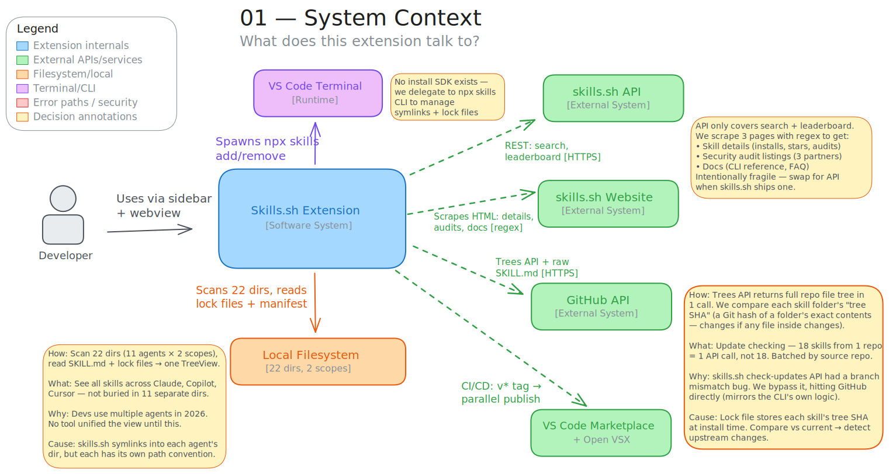
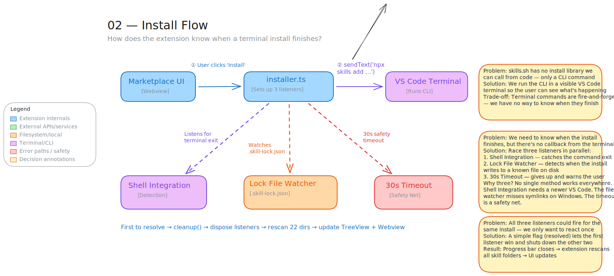
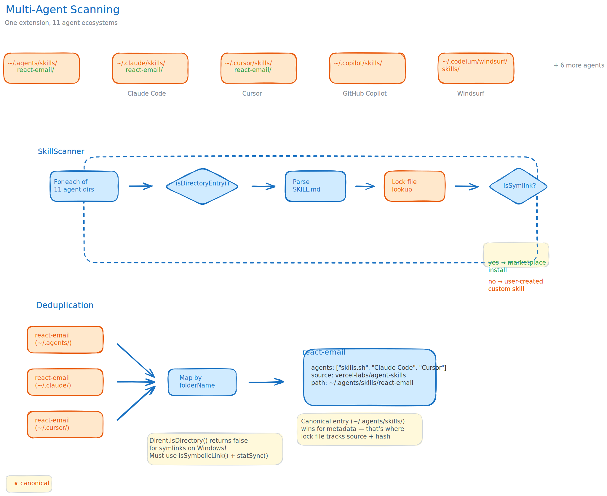
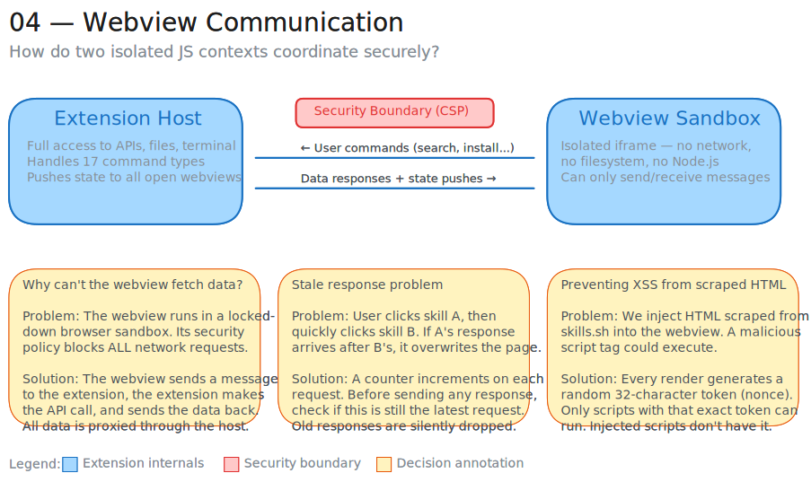
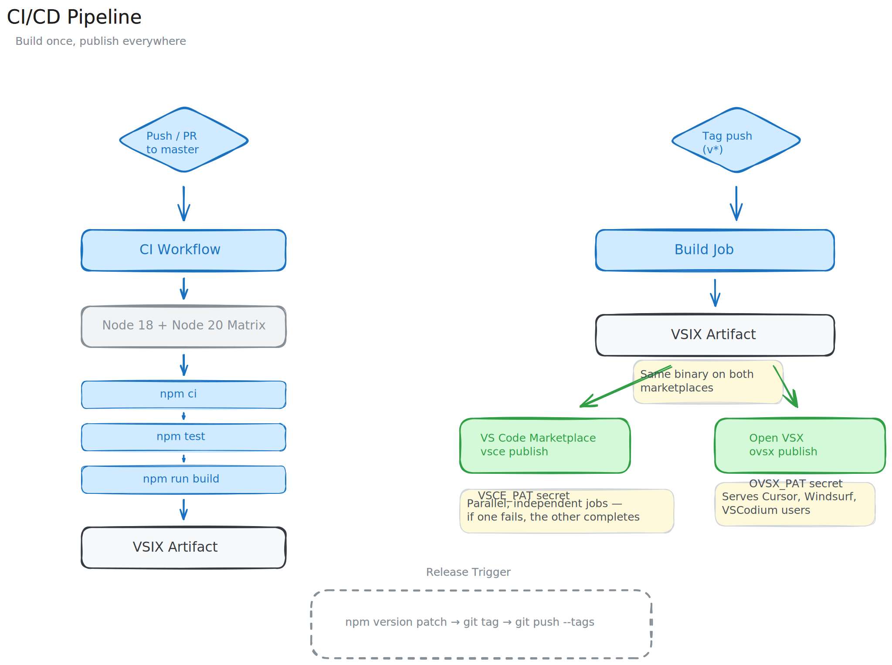

# Architecture

> Diagrams use the [Excalidraw](https://excalidraw.com) style. Source files are in this directory — editable with the [VS Code Excalidraw extension](https://marketplace.visualstudio.com/items?itemName=pomdtr.excalidraw-editor).

## System Overview

How the extension connects to external services, the local filesystem, and the terminal.

## Install Flow — Triple-Redundant Detection

The most interesting technical challenge: three independent mechanisms detect when a terminal install completes, because no single approach works reliably across all platforms.

## Multi-Agent Scanning & Deduplication

The scanner reads 11 AI agent skill directories, follows symlinks (a Windows gotcha), and deduplicates skills that appear in multiple agents.

## Webview Communication

The extension host (Node.js) and marketplace webview (browser iframe) coordinate through a typed postMessage protocol with 17 command types.

## CI/CD Pipeline — Build Once, Publish Everywhere

A single VSIX artifact is built once, then published to two marketplaces in parallel — if one fails, the other still completes.

